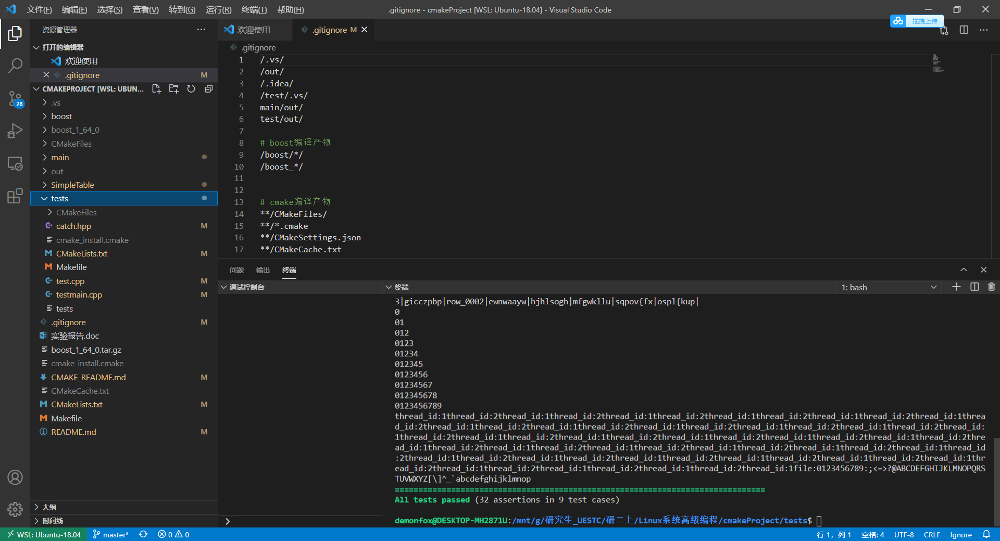

# SimpleTable
实现一个简单的表
# 说明
1. 设计文档写的还行，代码不好
# 所学知识
1. catch.hpp对c++单元测试
2. cmake的语法之类的
3. 对于面向接口编程有了更深的理解
4. 对于UML进行实体关系建模更熟练

# 4. 如何编译

## 4.1 编译boost指定模块

- #### 解压

  tar -zxvf boos(tab)

- #### boost编译生成到指定目录`boost/` ，生成 ./b2 编译指定模块 serialization

```
./bootstrap.sh --with-libraries=serialization --prefix=../boost
```

- 编译

```
 ./b2 install --with-serialization
```


## 4.2 cmake find_package

### 4.2.1 设置find_package路径(坑巨多)

- 报错如下

```
  Unable to find the requested Boost libraries.

  Unable to find the Boost header files.  Please set BOOST_ROOT to the root
  directory containing Boost or BOOST_INCLUDEDIR to the directory containing
  Boost's headers.
```

- 目录如下

```
- boost
  -include
  -lib
- tests
  -CmakeLists.txt
```

- 设置如下

```
SET(BOOST_ROOT ../boost/) 
```

```
# 设置find_package查找目录
SET(BOOST_ROOT ../boost/) 
find_package(Boost COMPONENTS serialization REQUIRED)

if(NOT Boost_FOUND)
    message("NOT found Boost")
endif()

include_directories(${Boost_INCLUDE_DIRS})

add_executable(tests testmain.cpp test.cpp) # 将catch分离，加快编译

target_link_libraries(tests PRIVATE libtable pthread ${Boost_LIBRARIES})
```

首先，cmake本身不提供任何搜索库的便捷方法，所有搜索库并给变量赋值的操作必须由cmake代码完成，比如FindXXX.cmake和XXXConfig.cmake。只不过，库的作者通常会提供这两个文件，以方便使用者调用。
find_package采用两种模式搜索库：

Module模式：搜索CMAKE_MODULE_PATH指定路径下的FindXXX.cmake文件，执行该文件从而找到XXX库。其中，具体查找库并给XXX_INCLUDE_DIRS和XXX_LIBRARIES两个变量赋值的操作由FindXXX.cmake模块完成（先搜索当前项目里面的Module文件夹里面提供的FindXXX.cmake，然后再搜索系统路径/usr/local/share/cmake-x.y/Modules/FindXXX.cmake）
Config模式：搜索XXX_DIR指定路径下的XXXConfig.cmake文件，执行该文件从而找到XXX库。其中具体查找库并给XXX_INCLUDE_DIRS和XXX_LIBRARIES两个变量赋值的操作由XXXConfig.cmake模块完成。

对于可能没有***.cmake和***Config.cmake的库文件，可以直接找到其头文件和库文件所在文件夹，直接进行路径赋值：

```
SET(LAPACK_DIR /usr/local/lib/) 
SET(LAPACK_INCLUDE_DIRS /usr/local/include) 
SET(LAPACK_LIBRARIES /usr/local/lib)
```

### 4.3.2 需要包含具体的模块


## 4.3 cmake include_directories

- 
  用来提供找头文件路径的

打个比方，我现在想要#include"cv.h",但是这个cv.h的路径是/usr/local/include/opencv,那么我总不能在主函数头前写
#include “/usr/local/include/opencv/cv.h”吧，这个时候就用到include_directories了，它提供了一个搜索头文件暂时的根目录，即你可以在cmakelists中写上`include_directories(/usr/local/include)`来让库文件搜索以/usr/local/include为基础，即在main函数前写上#include “opencv/cv.h"即可

- 区别

`include_directories(x/y)` affects directory scope. All targets in this CMakeList, as well as those in all subdirectories added after the point of its call, will have the path `x/y` added to their include path.

`target_include_directories(t x/y)` has target scope—it adds `x/y` to the include path for target `t`.

You want the former one if all of your targets use the include directories in question. You want the latter one if the path is specific to a target, or if you want finer control of the path's visibility. The latter comes from the fact that `target_include_directories()` supports the `PRIVATE`, `PUBLIC`, and `INTERFACE` qualifiers.

## 4.4 add_library

## 4.5 CMAKE 指定输出路径

https://blog.csdn.net/nan_feng_yu/article/details/80808773

# 5. wsl下测试

