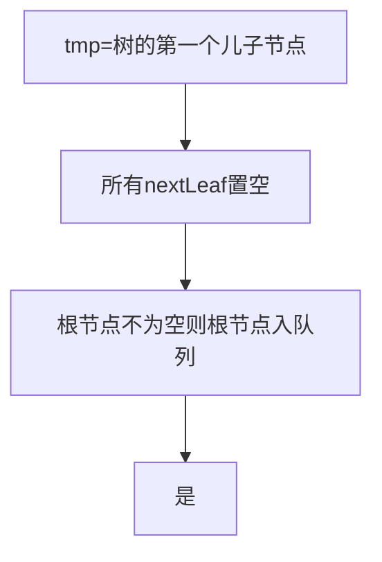

单元测试的实现：https://blog.csdn.net/wyyy2088511/article/details/80107131

boost单元测试：https://blog.csdn.net/zhangxiao93/article/details/53169208

一个B+树的存储引擎：https://github.com/zcbenz/BPlusTree

c++实现B+Tree

https://blog.csdn.net/u010164190/article/details/72729824

模板类的继承

设计一个类代表数据，这个类重载了>运算符，==运算符


# c++文件操作

fgetc(fp)==EOF; 判断结尾

fseek不返回-1到文件末尾不会返回-1


# 什么是catch.hpp

http://blog.guorongfei.com/2016/08/22/cpp-unit-test-catch/http://blog.guorongfei.com/2016/08/22/cpp-unit-test-catch/

单元测试：catch.hpp

不用配置其它相关环境，只需要包含一个头文件

这几乎是不需要解释就可以理解的读懂的代码。这种测试方式称为 BDD（Behaviour Driven Development），是最新的一种测试方式，它强调的是“行为”而不是“测试”，有兴趣可以看 看[这篇文章](https://dannorth.net/introducing-bdd/)。


# cmake

在cmake语法中，link_libraries和target_link_libraries是很重要的两个链接库的方式，虽然写法上很相似，但是功能上有很大区别：

1，link_libraries用在add_executable之前，target_link_libraries用在add_executable之后

2，link_libraries用来链接静态库，target_link_libraries用来链接导入库，即按照header file + .lib + .dll方式隐式调用动态库的.lib库

> -lpthread 
>
> in Cmake: target_link_libraries(test PRIVATE libtable pthread)

https://github.com/danielScLima/BPlusTree#markdown-header

```objectivec
mermaid
graph TD
    id[带文本的矩形]
    id4(带文本的圆角矩形)
    id3>带文本的不对称的矩形]
    id1{带文本的菱形}
    id2((带文本的圆形))
```


# BplusTree流程图




# 2020年10月17日09:10:05

1. 搞懂cmake

2. 在windows下重组项目

3. 将Table类、column类、row初稿完成

4. 连接到远程Linux

5. ```
   参考的是visual studio的文档：
   https://docs.microsoft.com/zh-cn/cpp/build/get-started-linux-cmake?view=vs-2019, 其中主要的步骤如下：
   1.	虚拟机主机相互ping通，需要设置虚拟机网卡为NAT，如图4.2、4.3所示。
   2.	安装openssh，sudo apt install openssh-server
   3.	启动openssh, sudo service ssh start , 永久启动sudo systemctl enable ssh
   4.	visual studio连接到Linux, 如图4.4 所示。
   
   ```

   

# CMakeLists

```
cmake_minimum_required(VERSION 3.12)
project(Program VERSION 1.0.0)

include_directories(..)
aux_source_directory(.. SOURCES)

add_library(
	libtable
	${SOUCES}/ISimpleTable.h
	${SOUCES}/ISimpleTable.cpp
)

add_executable(test test.cpp)

target_link_libraries(test PRIVATE libtable)
```

报错原因？

修正后

```
cmake_minimum_required(VERSION 3.12)
project(Test VERSION 1.0.0)

include_directories(../SimpleTable)
aux_source_directory(../SimpleTable SOURCES)
add_library(
	libtable
	${SOURCES} // 包含项目文件夹
)

add_executable(test test.cpp)

target_link_libraries(test PRIVATE libtable)
```

不想要静态库，直接源文件


在test中构造单元测试

在main中写相关初稿

多目录工程 https://blog.csdn.net/qq_36355662/article/details/80059432

配置visulstudio链接到linux


# 2020年10月18日08:55:29

return char * will cause memory leak ?

c++ NULL , 0 , nulpter

string 是在namespace std中


# C++ MUTEX

（将mutex传入线程）https://blog.csdn.net/aixintianshideshouhu/article/details/94599830

https://blog.csdn.net/li1615882553/article/details/85342101

(单例模式的线程安全例子)https://blog.csdn.net/sinat_31135199/article/details/76635052?biz_id=102&utm_term=c++%E5%8D%95%E4%BE%8B%E6%A8%A1%E5%BC%8F%20mutex&utm_medium=distribute.pc_search_result.none-task-blog-2~blog~sobaiduweb~default-1-76635052&spm=1018.2118.3001.4187

# c++ 设计模式

参考: https://zhuanlan.zhihu.com/p/94877789

> 注意：类中的静态成员初始化必须在类外实现，且如果出现mutiple defination 必须要把初始化放到cpp文件中

Table

row

columnInfo

# C++ 继承模板类

# C++ 序列化

配置boost库 ： https://blog.csdn.net/reasonyuanrobot/article/details/106723854?utm_medium=distribute.pc_relevant.none-task-blog-BlogCommendFromMachineLearnPai2-2.channel_param&depth_1-utm_source=distribute.pc_relevant.none-task-blog-BlogCommendFromMachineLearnPai2-2.channel_param

boost序列化、反序列化

序列化存储map https://www.codercto.com/a/19150.html

```
    private:
        friend class boost::serialization::access;

        template <class Archive>
        void serialize(Archive &ar, const unsigned int version)
        {
            ar &boost::serialization::base_object<T>(*this);
        }
```

```
It may not be immediately obvious how this one template serves for both saving data to an archive as well as loading data from the archive. The key is that the & operator is defined as << for output archives and as >> input archives. The "polymorphic" behavior of the & permits the same template to be used for both save and load operations. This is very convenient in that it saves a lot of typing and guarantees that the saving and loading of class data members are always in sync. This is the key to the whole serialization system.
```


# find_package(Boost COMPONENTS serialization REQUIRED)

```
cmake_minimum_required(VERSION 3.19)

# Define project name
project(boost_serialization)

find_package(Boost COMPONENTS serialization REQUIRED)

if(NOT Boost_FOUND)
    message("NOT found Boost")
endif()

include_directories(${Boost_INCLUDE_DIRS})

add_executable(main main.cpp)

link_directories("/usr/lib/x86_64-linux-gnu/")

target_link_libraries(main ${Boost_LIBRARIES})

```

https://frank909.blog.csdn.net/article/details/91813332?utm_medium=distribute.pc_relevant.none-task-blog-BlogCommendFromMachineLearnPai2-3.channel_param&depth_1-utm_source=distribute.pc_relevant.none-task-blog-BlogCommendFromMachineLearnPai2-3.channel_param


# Steps

## install cmake&&boost realted tools

sudo apt-get install cmake libblkid-dev e2fslibs-dev libboost-all-dev libaudit-dev

# cmake docs

## for mutex

add_definitions(-std=c++11)

## for muti-main()

As the unit test has a main,we must add

> list(REMOVE_ITEM SIMPLETABLE_SRCS ${PROJECT_SOURCE_DIR}/SimpleTable.cpp)

# config the chinese support in ubuntu seems wasting time